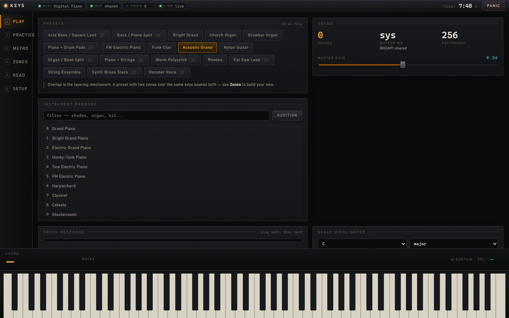
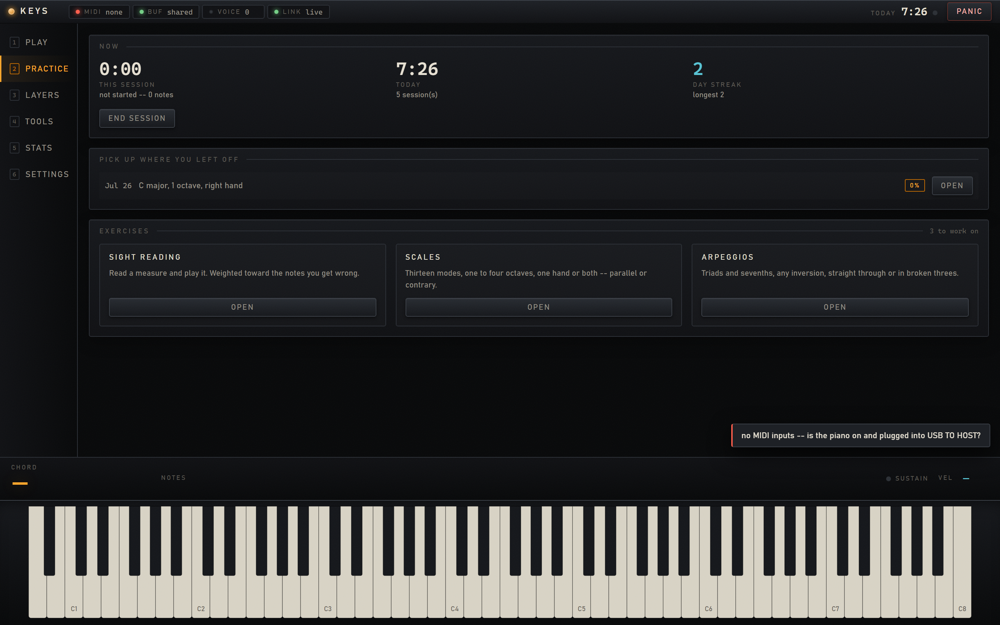
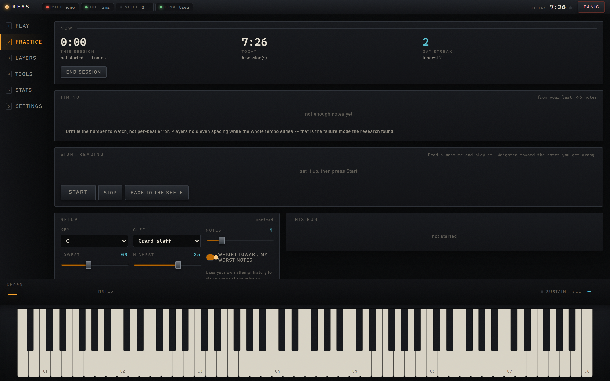
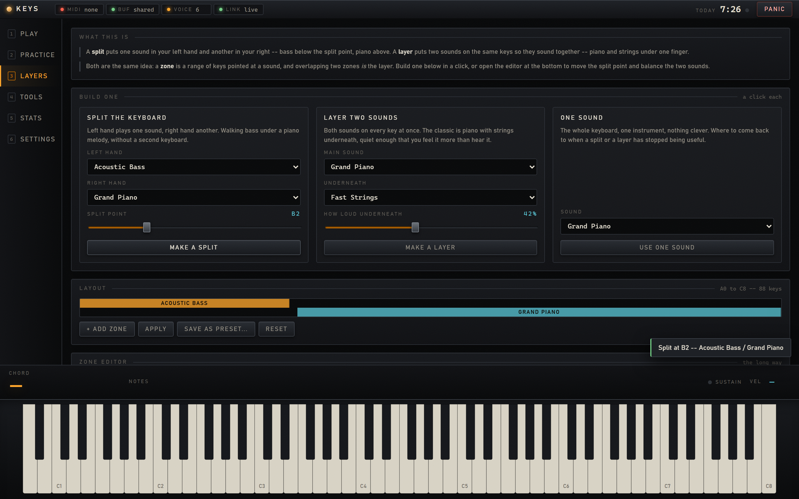
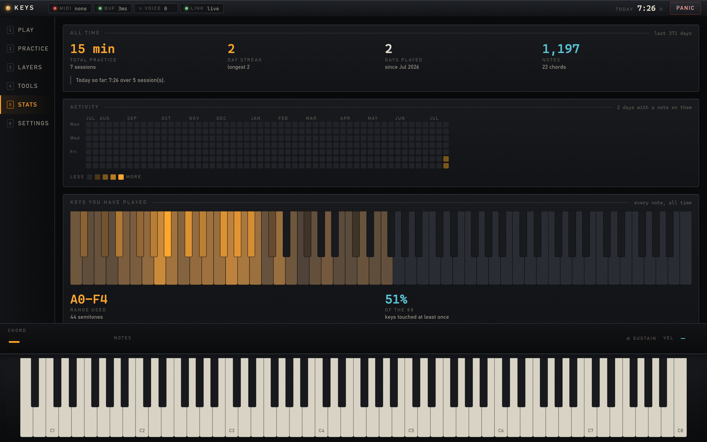

<!-- A CRT wordmark belongs here; docs/assets/README.md carries the prompt. Text until it exists —
     a README that opens with a broken-image icon is worse than one that opens with a word. -->
<h1 align="center">K E Y S</h1>

<p align="center">
  <strong>A MIDI piano that answers in three milliseconds.</strong><br/>
  A local-first workspace for the instrument you already own — plug in, run one command, play.
</p>

<p align="center">
  <a href="LICENSE"></a>
  <a href="https://github.com/TerraByte-Dev/Keys/releases/latest"></a>
  
  
  
</p>

<p align="center">
  <a href="#get-started">Get started</a> ·
  <a href="#features">Features</a> ·
  <a href="#screenshots">Screenshots</a> ·
  <a href="#architecture">Architecture</a> ·
  <a href="#troubleshooting">Troubleshooting</a> ·
  <a href="CONTRIBUTING.md">Contributing</a> ·
  <a href="LICENSE">License</a>
</p>

<p align="center">
  <sub>brought to you by</sub><br/>
  <a href="https://github.com/TerraByte-Dev"></a>
</p>

---

Keys is a **workspace** for a USB piano — a room you open and play in, at your own pace, with nothing to enrol
in and nobody grading you. MIDI comes in, **FluidSynth** renders it through WASAPI in exclusive mode at a
measured **3.00 ms**, and a browser UI hangs off the side showing what you played — never in the path of what
you hear. It's **local-first**: no account, no telemetry, fonts already on your machine, and a practice history
that lives in a SQLite file you own. Nothing leaves the machine and nothing is fetched — with exactly one
exception, opened only when you ask for it: a backing track loads YouTube's player. The frontend has **no build
step and no dependencies** — vanilla ES modules served straight off disk. There is no `package.json`.

It isn't a tutor and it isn't Synthesia. There's no curriculum, no unlock sequence, no streak-shaming. What
there is: hundreds of instruments a click away, splits and layers you can build in seconds, a metronome that
can't drift, sight-reading when you want it — and, underneath all of it, an **analytics layer that quietly
records everything** so you can look back and see which keys, chords and scales you actually reach for.

## Get started

**Prerequisites**

- **Python 3.11 or 3.12** — `python-rtmidi` publishes no wheel for 3.13+.
- **[FluidSynth 2.x](https://github.com/FluidSynth/fluidsynth/releases)** — download the `-cpp11` zip, extract it,
  and put its `bin/` on `PATH`. *(It is not in winget, and `pip install fluidsynth` is an abandoned 2012 package —
  the binding you want is `pyfluidsynth`, which bundles no native library.)*
- **A SoundFont** — [GeneralUser GS 2.0.3](https://github.com/mrbumpy409/GeneralUser-GS) saved to
  `soundfonts/GeneralUser-GS.sf2`.
- A class-compliant USB MIDI keyboard. Developed and measured against a **Yamaha P-71B**; the 88-key display
  assumes the standard MIDI range 21–108.

**Run**

```bash
git clone https://github.com/TerraByte-Dev/Keys.git
cd Keys
python -m venv .venv
.venv\Scripts\pip install -r requirements.txt
.venv\Scripts\python keys.py        # opens http://127.0.0.1:8770
```

That's the whole setup. The browser opens on its own, the MIDI port binds itself, and unplugging the piano and
plugging it back in needs no restart. `1`–`6` switch views, `M` toggles the metronome, `Esc` is panic.

> **FluidSynth somewhere else?** Set `KEYS_FLUIDSYNTH_BIN` to its `bin` directory. Everything else you'd want to
> change lives in **Settings**, and persists to a gitignored `config.local.json`.

## Features

- **Three milliseconds, measured** — WASAPI exclusive mode at a 144-sample buffer, verified on real hardware rather than estimated. Audio is rendered in FluidSynth's own C thread and **never passes through Python**. The MIDI callback does one thing and stops; everything else runs off a bounded queue that drops frames instead of blocking a note.
- **Layers: splits and layers on one keybed** — a *split* puts bass in your left hand and piano in your right; a *layer* puts piano and strings on the same keys. Both are one idea: a zone is a range of keys pointed at a sound, and **overlapping two zones *is* the layer**. One click each, with a full editor underneath for transpose, gain, pan, sends and velocity curves.
- **A loop station — be your own band** — record a few bars, they start looping, then play over the top and record that too. Bass, chords, melody, up to five layers, each keeping the instrument you played it with. Takes are locked to the bar and end themselves on the bar line, so a loop never drifts the way a hand-stopped one does; the pedal is captured as note length, so a sustained part sustains.
- **Backing tracks** — paste a YouTube link, set loop points, and grind eight bars of a solo without hunting the scrubber. Slow it down to learn it, and keep the key and tempo written next to it. (It tells you when exclusive mode has the speakers, instead of playing silently and looking broken.)
- **18 presets, 287 instruments** — presets are plain JSON you can edit by hand. The instrument browser enumerates every preset the SoundFont actually contains — including all 13 drum kits — rather than trusting the GM chart.
- **Exercises you can pick up** — scales in any key and mode, one hand or both, parallel or contrary; arpeggios with inversions; sight reading. Hands-together steps carry both notes, so the spread between your hands is measured directly — the thing most people plateau on and nobody else surfaces.
- **A practice clock that doesn't flatter you** — time is credited *between consecutive notes*, capped at a grace window, so "34 minutes" means minutes with your hands on the keys and not minutes with the app open. Streaks, a 90-day calendar, and a per-key heatmap of what you actually use.
- **A metronome on the audio clock** — clicks are scheduled on FluidSynth's sequencer, driven by the render thread, so they cannot drift against the sound. Tempo ramp with a one-key setback when you miss. It measures **drift**, not just per-beat error — players hold even spacing while the whole tempo slides, and that's the failure mode worth seeing.
- **Sight reading that adapts** — a hand-rolled SVG grand staff (no notation engine), enharmonically spelled by key signature, weighting each new measure toward *your* worst notes from your own attempt history.
- **Chords, named properly** — inversions, slash chords and extensions, spelled to the key you're in: in E♭ major it reads `Eb`, not `D#`. Detection runs in ~19 µs, sixty times a second.
- **Honest instrumentation** — the latency panel reports the one number software can actually see and says plainly what it excludes. Nothing in software can measure MIDI-to-ear latency, and this app doesn't pretend otherwise.

## Screenshots

<p align="center">
  
</p>
<p align="center">
  <sub><b>The keyboard never leaves.</b> It's docked to the bottom edge in every view and lights amber under your fingers, scaled by velocity.</sub>
</p>

<table>
  <tr>
    <td width="50%" valign="top">
      <br/>
      <sub><b>Practice</b> — a session clock and a shelf: scales, arpeggios and sight reading.</sub>
    </td>
    <td width="50%" valign="top">
      <br/>
      <sub><b>Sight reading</b> — a real grand staff with key signatures and correct ledger lines, weighted toward your weakest notes.</sub>
    </td>
  </tr>
  <tr>
    <td width="50%" valign="top">
      <br/>
      <sub><b>Layers</b> — a split or a layer in one click, with the full editor underneath.</sub>
    </td>
    <td width="50%" valign="top">
      <br/>
      <sub><b>Stats</b> — a year of activity, an 88-key heatmap, and the keys you actually play in.</sub>
    </td>
  </tr>
</table>

## Architecture

One process, four threads, and a strict rule about which of them may be slow.

```
  piano ──USB──> rtmidi callback thread ──> FluidSynth (C render thread) ──> WASAPI ──> speakers
                          │                                     ▲
                          │ bounded deque                       │ sequencer (metronome)
                          ▼                                     │
                  asyncio drain @60Hz ──> websocket ──> browser UI
```

The MIDI callback routes a note and appends a tuple. It never logs, locks, allocates a dict, or touches a socket.
Zone changes build a whole new routing table and swap it in one atomic assignment, which is why there is no lock
anywhere near the hot path. If the UI stalls, the queue sheds its oldest events and a 1 Hz heartbeat carrying the
engine's own held-note set puts the display back in sync.

- `keys.py` — the launcher.
- `backend/__init__.py` — load-bearing: sets the GIL switch interval and `PATH` before anything can import FluidSynth.
- `backend/engine.py` — the Synth, the zone routing table, the hot path. `backend/midi_in.py` — rtmidi + hotplug.
- `backend/hub.py` — the bounded queue between the callback thread and everything else.
- `backend/metronome.py` — sequencer scheduling. `backend/music.py` — spelling, intervals, chord detection.
- `backend/store.py` / `practice.py` — SQLite practice log and the idle-aware clock.
- `frontend/` — `app.js` shell + websocket, `keyboard.js` the 88-key component, `views/*.js`, `style.css`.

Deeper notes: [`docs/ARCHITECTURE.md`](docs/ARCHITECTURE.md) (the invariants and why they exist),
[`docs/HARDWARE.md`](docs/HARDWARE.md) (every measured number, and the settings that fail silently),
[`docs/ROADMAP.md`](docs/ROADMAP.md) (what's built and what's deliberately skipped),
[`docs/PACKAGING.md`](docs/PACKAGING.md) (building the Windows app, and the three ways PyInstaller lies to you).

## Troubleshooting

Run these in order — each is more specific than the last, and the first needs no virtualenv at all.

```bash
python tools\midi_probe.py                        # zero dependencies. Is the piano reaching Windows?
.venv\Scripts\python tools\audio_check.py         # is the audio path good?
.venv\Scripts\python tools\engine_check.py        # zones, presets, drum kits, metronome timing
.venv\Scripts\python tools\pipeline_check.py      # the whole app, no piano required
.venv\Scripts\python tools\frontend_check.py      # ES module syntax + asset wiring
```

**"Everything else went silent."** Exclusive mode gives Keys sole ownership of the output device, which is
exactly where the 3 ms comes from — while it runs, nothing else can play through that device. **Settings → Audio
output** switches to shared mode (Windows picks the buffer, ~10 ms) or pins Keys to a different output so you
keep both. Closing Keys always hands the device straight back.

**Every note has the same velocity.** That's the instrument, not the app: most digital pianos ship with a Touch
Sensitivity setting that transmits a constant velocity regardless of how hard you play. The **Play → Touch
response** meter tells you live, and on a Yamaha P-45/P-71 the fix is to hold `[GRAND PIANO/FUNCTION]` and press
the white key immediately left of middle C.

`engine_check` and `pipeline_check` open the audio device and make noise on purpose, so they refuse to run while
Keys is up — close it first, or pass `--force` if you know what you're doing.

## Development

```bash
.venv\Scripts\python tools\pipeline_check.py    # end-to-end: engine, hub, websocket, practice, sight reading
.venv\Scripts\python tools\frontend_check.py    # every ES module parses; needs Node for the syntax pass
```

The full suite is ten checks and 717 assertions; see [`CONTRIBUTING.md`](CONTRIBUTING.md). There is no
bundler, no transpiler and no `node_modules` — editing `frontend/` and reloading the page is the whole loop.

## License

[MIT](LICENSE) © TerraByte Solutions LLC.

<p align="center">
  <a href="https://github.com/TerraByte-Dev"></a><br/>
  <sub>An open-source project by <strong>TerraByte Solutions LLC</strong></sub>
</p>
